# TOC Project 2020
## 作者
姓名:鍾維廷
學號:F74076302

## 介紹
----------------------------
此line bot為參考我喜愛的遊戲,Monster Hunter World魔物獵人為原型,開發而成的回合制打怪遊戲。
本款也承襲了其原作收集、打怪、練等的元素,許多物品和名稱都仿效其中原有的物件。並且再加以改良成符合手機用戶的形式。

## 基本資訊

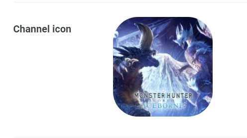

---------------------------
## 遊玩流程
一開始輸入 進入 便可開始遊戲。
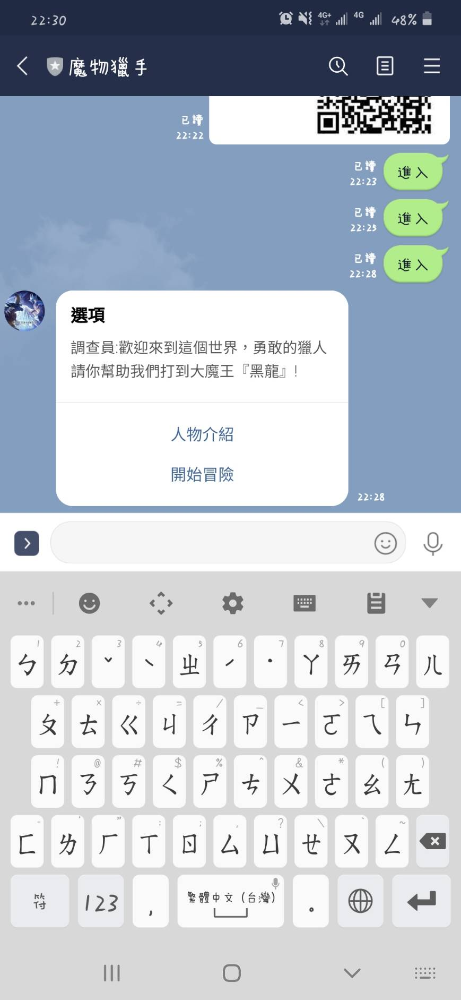

設定完名字和職業，按下完成，設定好基本角色資料。

總共有3種職業，按下職業介紹可得知個別的屬性。
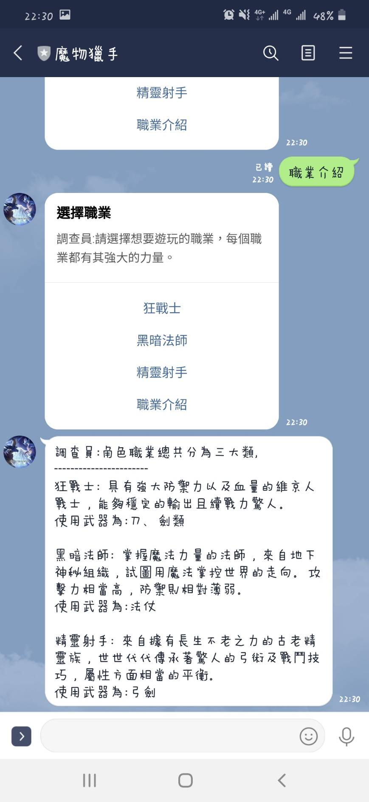

在主選單可查看當前角色資訊。
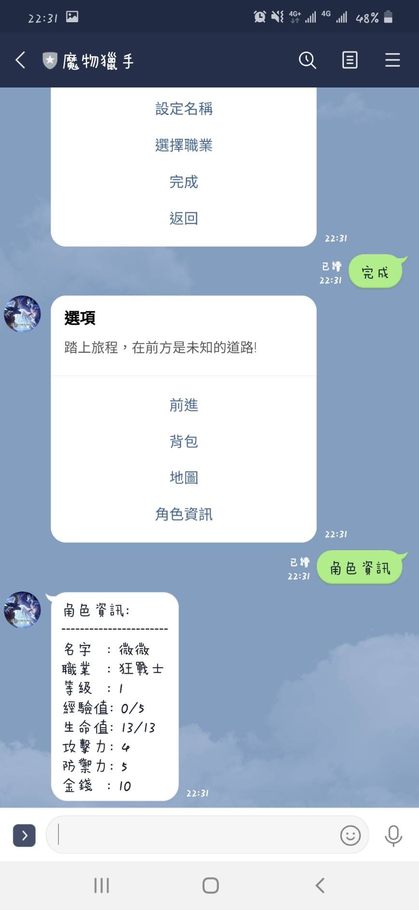

也可查看當前角色背包有甚麼物品。
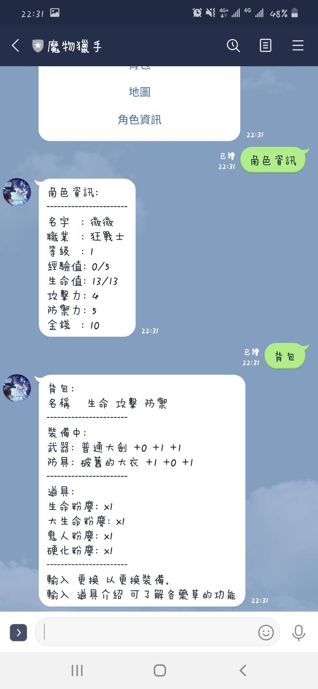

查看地圖可得到路線資訊，其中可能會遇到戰鬥和商店的狀況。
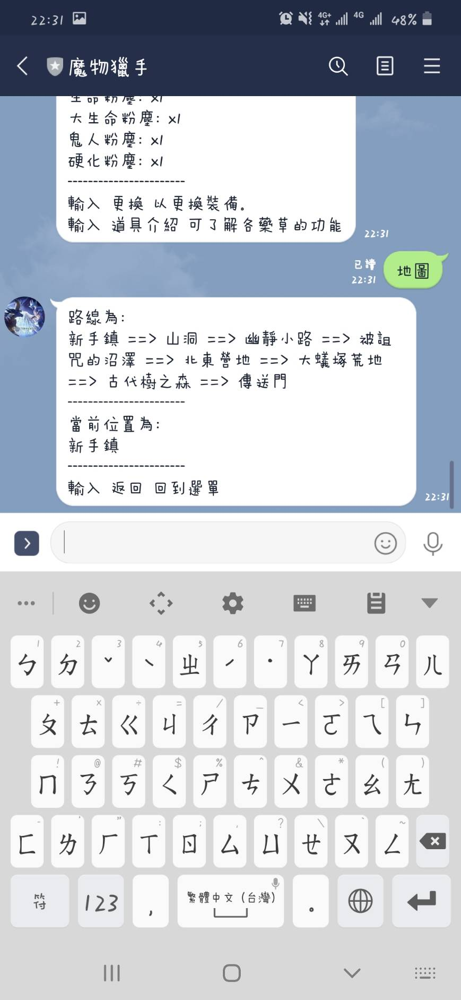

按下前進後，可移動到下一個地圖，並發生戰鬥或是商店。
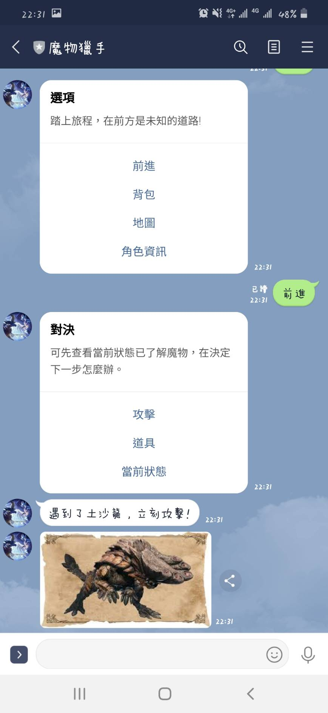

按下攻擊後，可看到造成的傷害，以及被魔物攻擊的傷害。
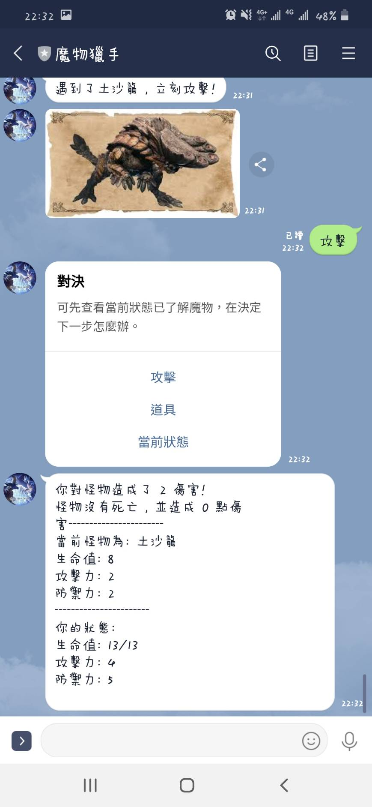

如果遇到困難，可打開道具來使用一些道具增加存活機率。
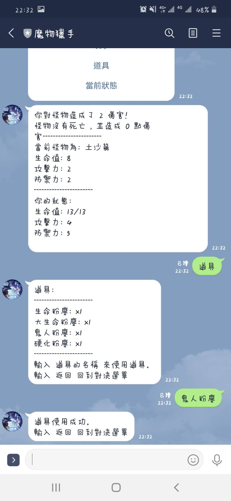

打敗魔物後,會得到經驗值、金錢或是有機率得到裝備。
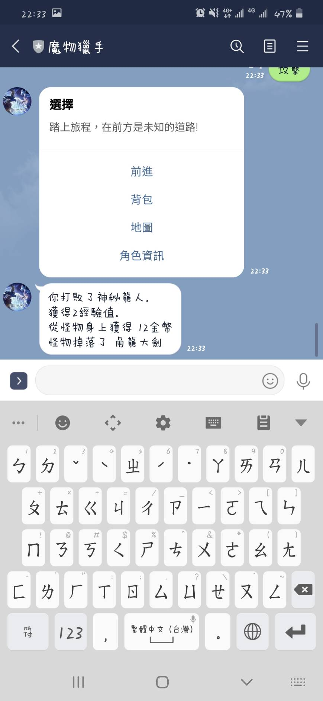

打到的裝備可至裝備區查看，並且輸入更換來更換裝備。
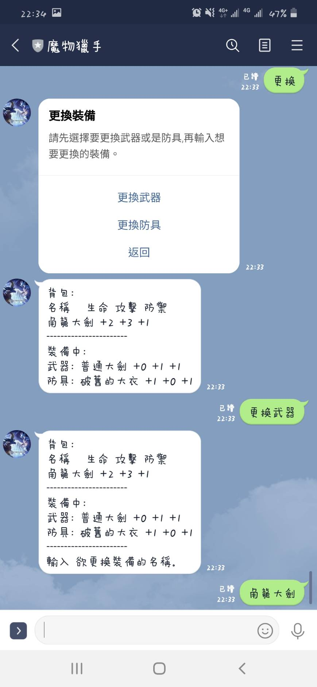

在前進的途中，如果遭遇商人，是可以購買商品的。
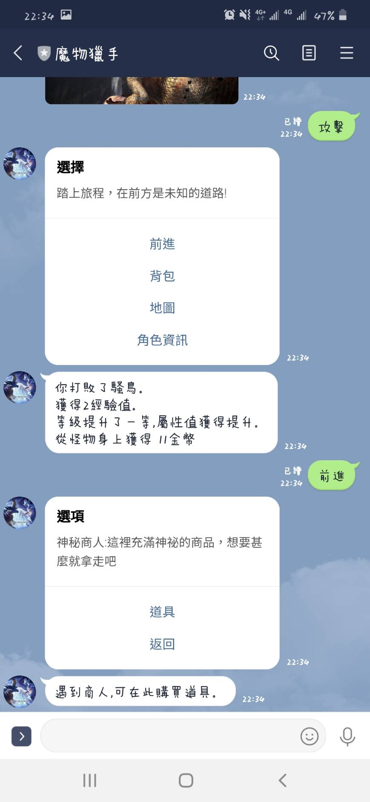
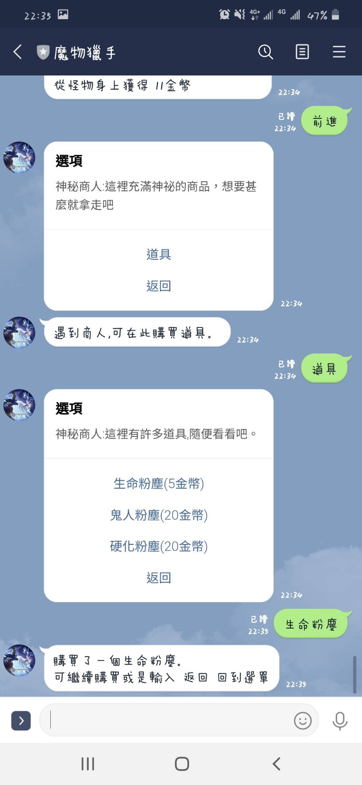

---------------------------
## FSM

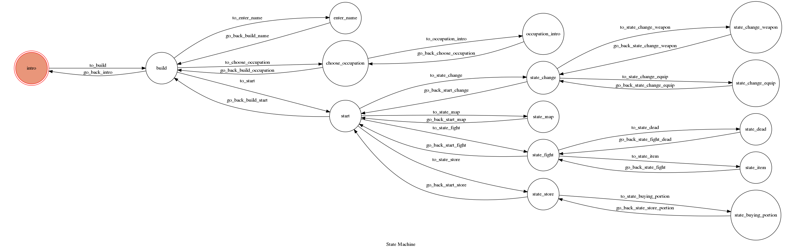